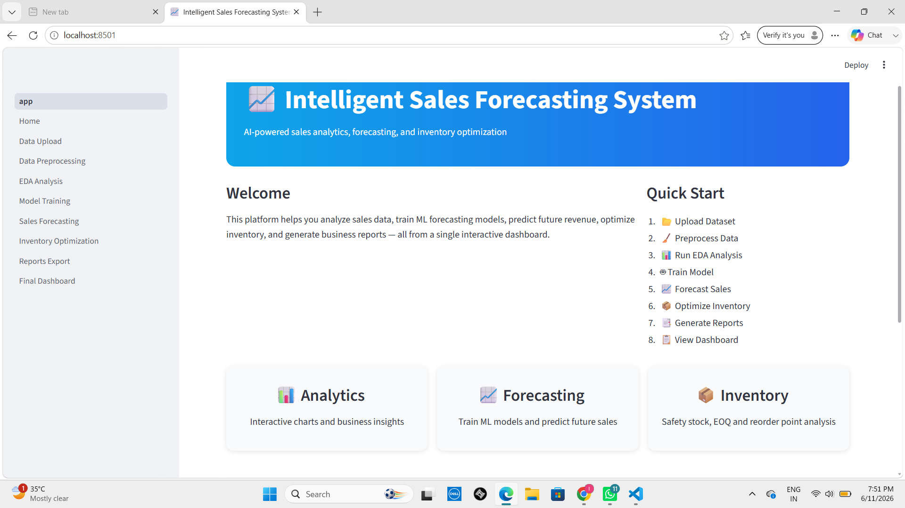
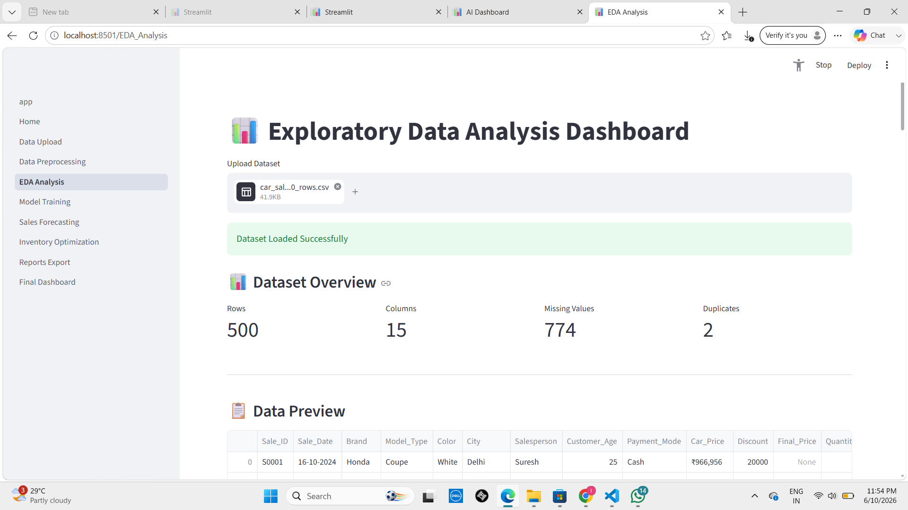

# Intelligent Sales Forecasting & Inventory Optimization

## Live Demo

https://nec-project-2-t21t.onrender.com

## 📸 Screenshots

### Dashboard

### Forecast & Analytics

## Project Overview

This project uses machine learning techniques to forecast future sales and optimize inventory management. The interactive Streamlit dashboard helps users analyze sales trends, generate forecasts, and make inventory decisions.

## Features

* Sales forecasting using machine learning
* Inventory optimization insights
* Interactive Streamlit dashboard
* Data visualization and reporting
* Excel data upload and analysis

## Technologies Used

* Python
* Streamlit
* Pandas
* NumPy
* Scikit-learn
* Matplotlib

## How to Run Locally

1. Clone the repository

2. Install dependencies

   pip install -r requirements.txt

3. Run the application

   streamlit run app.py

## Live Application

https://nec-project-2-t21t.onrender.com

## Author

Akshitha Reddy
